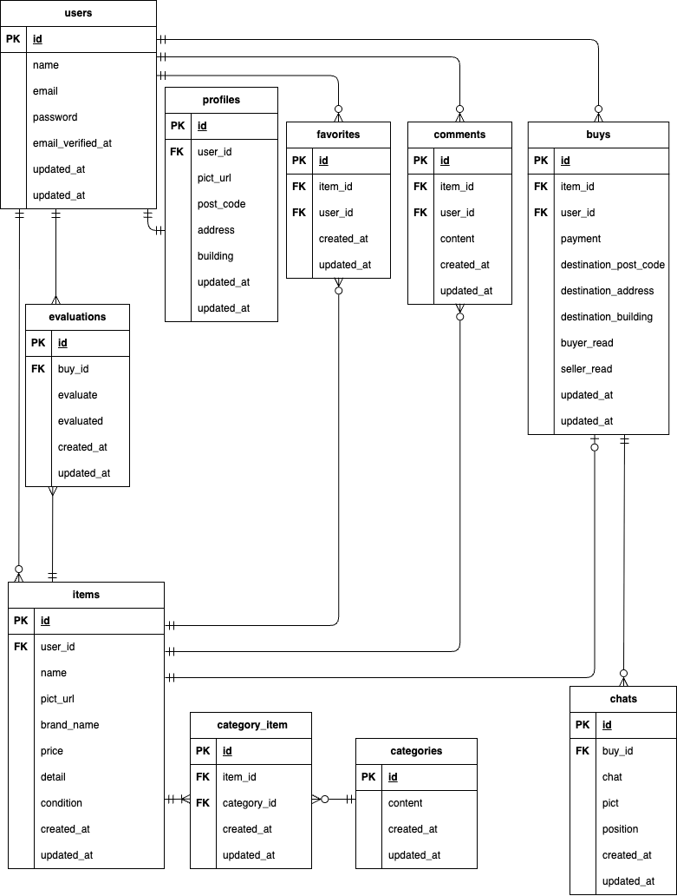

# Furima

## 環境構築

### Docker ビルド

1. git clone git@github.com:chatainazara/furima.git
2. DockerDesktop アプリを立ち上げる
3. docker-compose up -d --build

### Laravel 環境構築

1. docker-compose exec php bash

2. composer install

3. cp .env.example .env

4. .env に以下の環境変数を追加または変更
DB_CONNECTION=mysql  
DB_HOST=mysql  
DB_PORT=3306  
DB_DATABASE=laravel_db  
DB_USERNAME=laravel_user  
DB_PASSWORD=laravel_pass  

MAIL_MAILER=smtp  
MAIL_HOST=mailhog  
MAIL_PORT=1025  
MAIL_USERNAME=null  
MAIL_PASSWORD=null  
MAIL_ENCRYPTION=null  
MAIL_FROM_ADDRESS="noreply@example.com"  
MAIL_FROM_NAME="${APP_NAME}"  

STRIPE_KEY=pk_test_xxxxxxxxxxxxxxxxx（<-stripe の API キーをコピー）  
STRIPE_SECRET=sk_test_xxxxxxxxxxxxxxxxx（<-stripe の API キーをコピー）  

5. アプリケーションキーの作成
   php artisan key:generate

6. マイグレーションの実行
   php artisan migrate

7. シーディングの実行
   php artisan db:seed

8. ダミーデータの情報
   'name' => 'レンゲ',  
   'email' => 'renge@sakamaki-forest.com',  
   'password' => 'rengerenge',  
   CO01〜CO05の出品者  
  
   'name' => 'エンジュ',  
   'email' => 'enju@sakamaki-forest.com',  
   'password' => 'enjuenju',  
   CO06~CO10の出品者  
  
   'name' => 'オウレン',  
   'email' => 'ouren@sakamaki-forest.com',  
   'password' => 'ourenouren',  
   出品物はない  

9. シンボリックリンクの作成
   php artisan storage:link

### 決済実行用のダミークレジットカード

No 4242 4242 4242 4242
期限とセキュリティコードは任意の数字

### テストの実行

1. Mysqlコンテナに入る
    docker-compose exec mysql bash

2. MySQLコンテナ上
    $ mysql -u root -p
    パスワードを聞かれたら root

3. テスト用データベースを作成
    CREATE DATABASE demo_test;

4. phpコンテナで本アプリのテストを一度に実行
   vendor/bin/phpunit tests/Feature

5. 今回の入会試験部分だけ実行
   vendor/bin/phpunit tests/Feature/TransactionTest.php

## 使用技術(実行環境)

1. PHP: 8.1.33
2. Laravel: 8.83.29
3. MySQL: 8.0.2
4. nginx: 1.21.1
5. mailhog: 1.0.1
6. stripe: 17.6

## ER 図

## URL

### 開発環境

1. phpMyAdmin: http://localhost:8080
2. ユーザー登録画面: http://localhost/register
3. ホーム画面: http://localhost/
4. MailHog: http://localhost:8025

###　独自の条件解釈（機能要件から読み取れず、独自に解釈した条件）

1.  取引は商品購入後に発生する。また、一つの商品に対して出品者と購入者以外は取引に関与しない。
2.  1.より「取引中の商品」には購入したものまたはされたものが表示される。これは取引チャットの有無に関わらない。
3.  評価は購入者としての被評価も出品者としての被評価も総合した評価とする。
4.  出品者としての取引画面のサイドバーには購入者としての取引画面へのリンクは作らない。逆も同様。
5.  お互いの評価が完了したものは取引終了として、取引中の商品欄からクリックできないようにする

